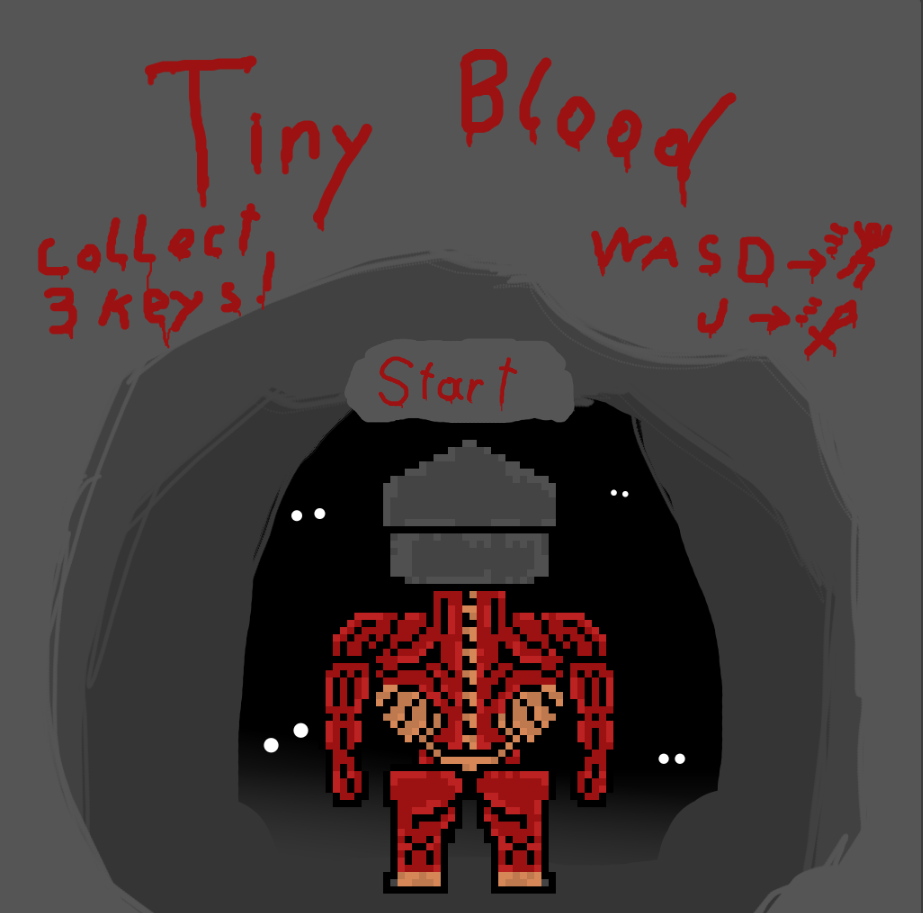

# 🩸 **Tiny Blood** 🩸

> **Short Pitch**: Tiny Blood is a topdown 2d exploration game. Where you have to explore a little cave, fight enemys and collect keys to win the game!

---

## 🌐 **Play the Game**
[Click here to play the game!](https://davidoppenauer.github.io/CCL1/)

---

## 📸 **Screenshots**

### Main Gameplay:

  
  
*Figure 1: Example of gameplay in action.*

---

### Menu and UI:

  
  
*Figure 2: Menu and user interface.*

---

## 🎨 **Spritesheets**
Below are the sprites used to create characters and objects in the game:

### Player Character:

  
  
*Figure 3: Player character animations.*

---

### Enemies and NPCs:

  
  
*Figure 4: Enemy animations.*

---

## ✍️ **Reflection**

### What went well:
- **Creative Design:** I didn't know what I was going for in the beginning, but I am happy with how the player and enemy sprites turned out.
- **Core Mechanics:** I really wanted to have combat that felt responsive, turning the enemies into bloodsplatters was the perfect solution.

### Challenges:
- **Cut Content:** The game was supposed to have a camera follow the player and gravity as well, after a week I gave up on those features.

### Lessons Learned:
- **Starting over:** I made many early versions of my game with different cameras and gravity, I learned a lot from that even if I didn't use that in the end.
- **Prototyping:** I started over many times and made many versions and prototypes of different functions to see what worked best, in the end it was worth it.
